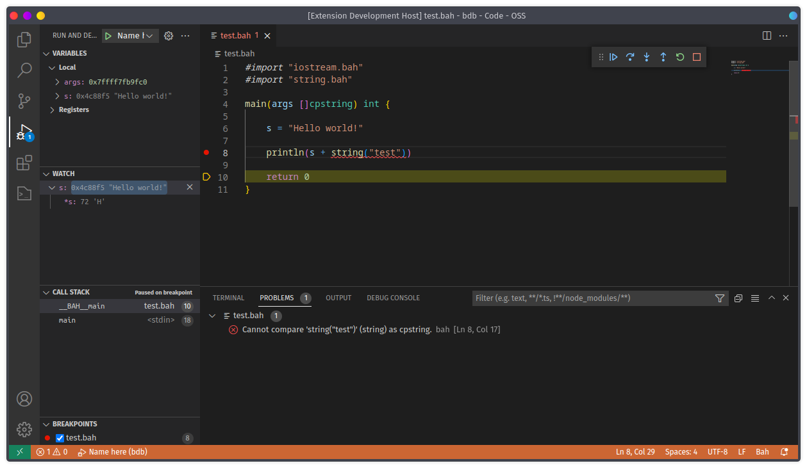

# Bah extension
Still in progress.

<div align="center">

</div>

## What is it about

- Syntax highlithing,
- basic intellisense,
- errors, warning and notices (on save),
- breakpoints (for debugging with gdb and others).

## Installing
First, you will need the Bah compiler installed on your machine.

### Linux
```bash
git clone https://github.com/ithirzty/bah-vscode
cp ./bah-vscode ~/.vscode/extensions/
```

### Windows
```bat
git clone "https://github.com/ithirzty/bah-vscode"
xcopy /E/H/C/I/Y "./bah-vscode" "%homedrive%%homepath%/.vscode/extensions/"
```
